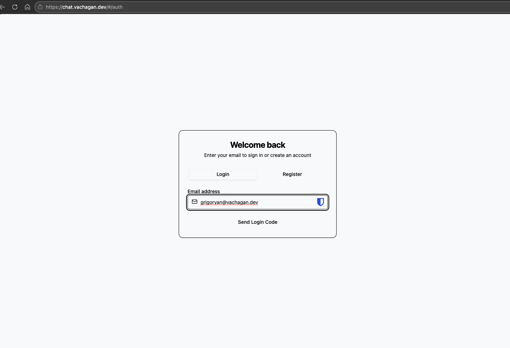
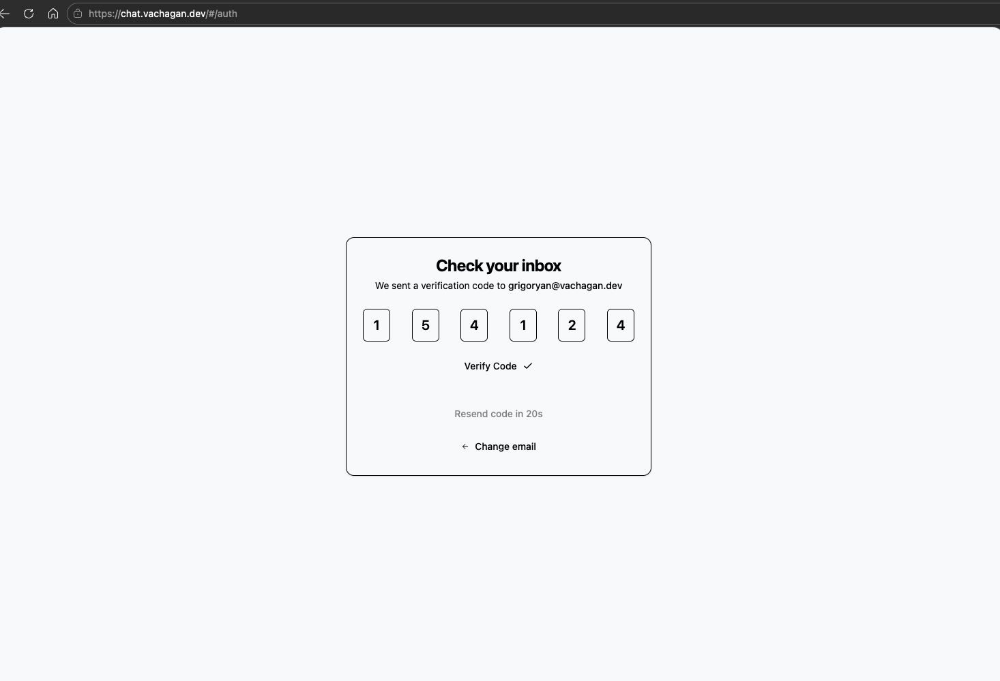
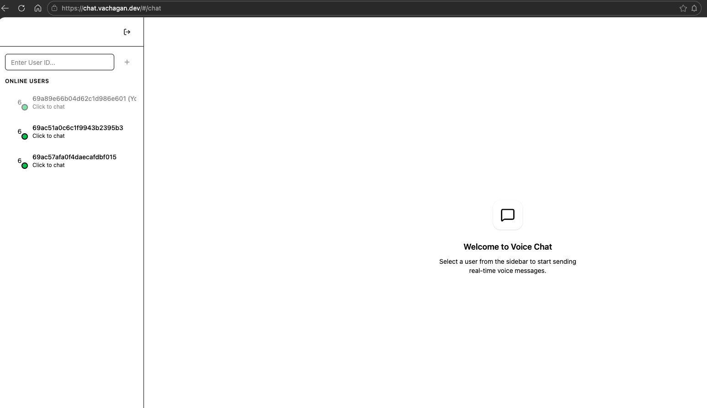
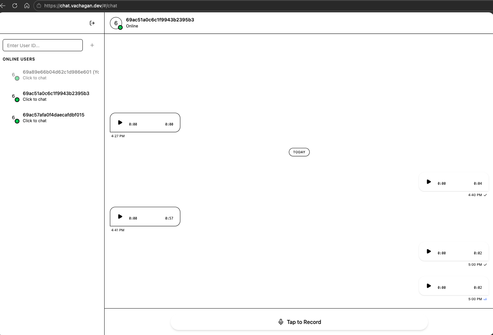
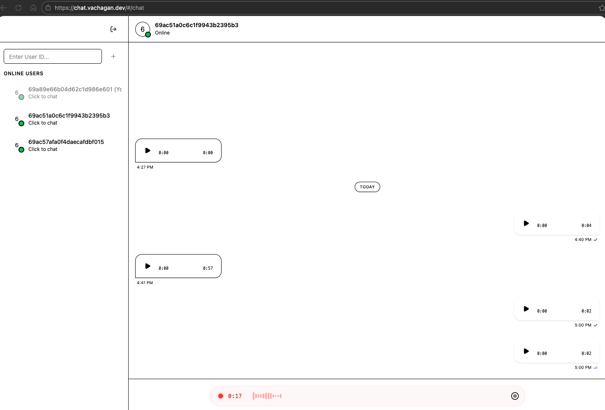

# VoiceChat — Real-Time Voice Messaging

VoiceChat is a **real-time voice messaging platform** built with:

- FastAPI backend
- Socket.IO realtime communication
- React + Vite + TypeScript frontend
- MongoDB, Redis, RabbitMQ
- Docker Compose deployment

The system allows users to **register via email verification**, send **voice messages**, and receive them **instantly via realtime sockets**.

---

# Public Demo

**Frontend**  
https://chat.vachagan.dev

**API Docs**  
https://voice-chat.vachagan.dev/docs

**Health Check**  
https://voice-chat.vachagan.dev/health/live

---

# Architecture

```
Frontend (React + Vite)
        │
        │ REST API
        ▼
FastAPI Backend
        │
        ├── MongoDB (users, messages)
        ├── Redis (rate limits, sessions)
        ├── RabbitMQ (background jobs)
        └── Socket.IO (realtime messaging)
```

---

# Features

### Authentication

- Email based login
- Verification code flow
- Access + refresh token authentication
- Token rotation

### Voice Messaging

- Upload voice messages
- Store audio files
- Retrieve chat history

### Realtime Delivery

- WebSocket communication
- Instant message delivery
- Delivery status updates

### Security

- Rate limiting
- JWT authentication
- Refresh token rotation
- CORS protection

---

# Screenshots

Place screenshots inside:

```
docs/screenshots
```

## Login / Register



*Email based authentication screen*

---

## Code Verification



*User enters the verification code received via email*

---

## Chat Interface






*Mobile optimized layout with fixed voice button*

---

# Frontend

Frontend is built using:

- Vite
- React
- TypeScript
- Socket.IO client

Example structure:

```
frontend/
  src/
    api/
    auth/
    chat/
    components/
    hooks/
    sockets/
```

Run locally:

```
cd frontend
npm install
npm run dev
```

Frontend runs at:

```
http://localhost:5173
```

---

# Backend

Backend uses:

- FastAPI
- Motor (MongoDB)
- Redis
- RabbitMQ
- Socket.IO

Run locally:

```
poetry install
poetry run uvicorn app.main:app --reload
```

API available at:

```
http://localhost:8000
```

Docs:

```
http://localhost:8000/docs
```

---

# WebSocket Events

Connection endpoint:

```
ws://voice-chat.vachagan.dev/socket.io
```

Authentication:

```
auth: {
  token: ACCESS_TOKEN
}
```

---

## Client → Server

### send_voice_message

```
{
  "receiver_id": "USER_ID",
  "message_id": "MESSAGE_ID"
}
```

---

## Server → Client

### receive_voice_message

```
{
  "message_id": "...",
  "sender_id": "...",
  "receiver_id": "...",
  "audio_url": "...",
  "created_at": "..."
}
```

### voice_message_status

```
{
  "message_id": "...",
  "status": "delivered"
}
```

---

# API Example

## Register

```
POST /auth/register
```

```
{
  "email": "user@example.com"
}
```

---

## Verify Code

```
POST /auth/verify
```

```
{
  "email": "user@example.com",
  "code": "123456"
}
```

Returns:

```
{
  "access_token": "...",
  "refresh_token": "..."
}
```

---

# Docker Deployment

Run the full stack:

```
docker compose up --build
```

Services started:

- MongoDB
- Redis
- RabbitMQ
- FastAPI
- Frontend

---

# Running Tests

Run integration tests inside docker:

```
docker compose run --rm tests
```

Or locally:

```
pytest -v
```

---

# Environment Variables

Example `.env`:

```
MONGO_URI=mongodb://mongo:27017/voicechat
REDIS_URL=redis://redis:6379
RABBITMQ_URL=amqp://rabbitmq
JWT_SECRET=supersecret
EMAIL_PROVIDER=mock
CORS_ALLOWED_ORIGINS=http://localhost:5173
```

---

# Project Structure

```
app/
  main.py
  modules/
    auth/
    messages/
    realtime/
  db/
  core/

tests/
  integration/
  unit/

frontend/
docs/
```

---

# Author

**Vachagan Grigoryan**

Portfolio  
https://vachagan.dev

GitHub  
https://github.com/VachaganGrigoryan
