<p align="center">
  
</p>

<p align="center"><strong>Voice, messages, media, and calls in one platform.</strong></p>

This is the web client for **Vogi**, built with React 19, TypeScript, Vite and Tailwind CSS v4. It talks to the FastAPI and Socket.IO backend in the sibling [`VoiceChat`](../VoiceChat) repository and also ships as an Android app through Capacitor ([`mobile/`](./mobile/README.md)).

<p align="center">
  
</p>

## Features

- **Chat**: DMs and groups with threads, reactions, pins, edits, forwarding, drafts, scheduled messages, voice notes, media and rich content.
- **Spaces and channels**: a space groups channels and groups. Every channel opens in a **feed** lens (posts and comments) or a **chat** lens (timeline), over the same messages.
- **Feed**: a home feed from the people and channels you follow, plus saved posts.
- **Discover and People**: find people, channels, spaces and groups. Manage contacts, follows, followers and blocks.
- **Activity**: notifications, mentions, connection requests and call logs.
- **Calls**: 1:1 voice and video over WebRTC, with recovery after a reload.
- **Management**: per-space, per-channel and per-group settings, roles and invites, available as a slide-over sheet or as deep-linkable `/manage` pages.
- **Settings**: theme (light, dark or system), colour palette, font size, density, notifications, privacy, and passkeys.
- **Realtime** throughout: messages, receipts, typing, presence and permission changes over Socket.IO.

## Screenshots

| | |
|---|---|
| 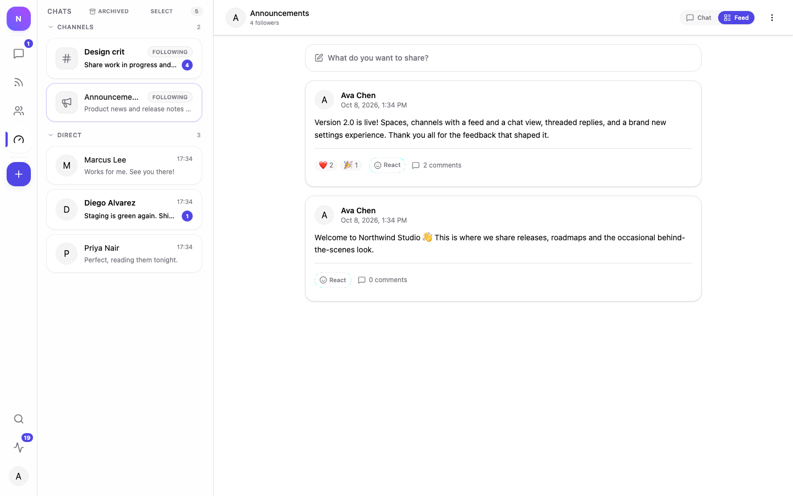 | 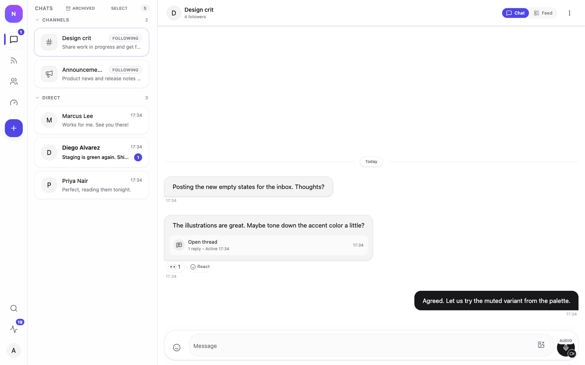 |
| Channel, feed lens | Channel, chat lens |
| 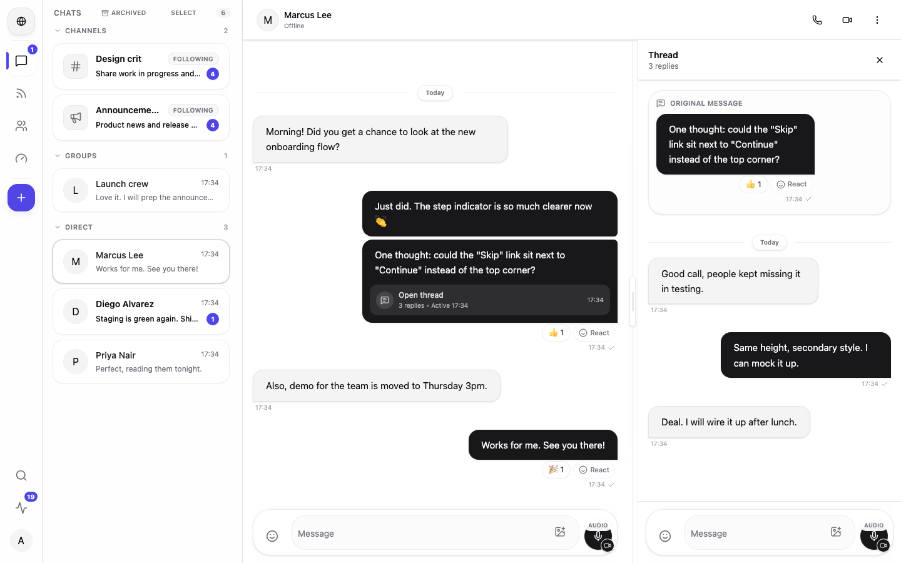 | 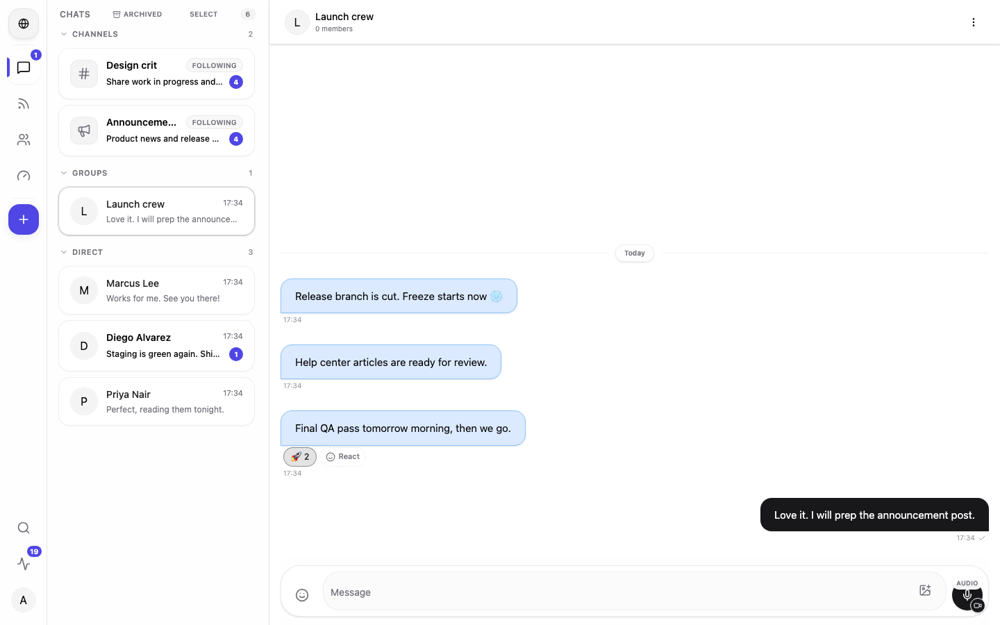 |
| Thread panel | Group conversation |
| 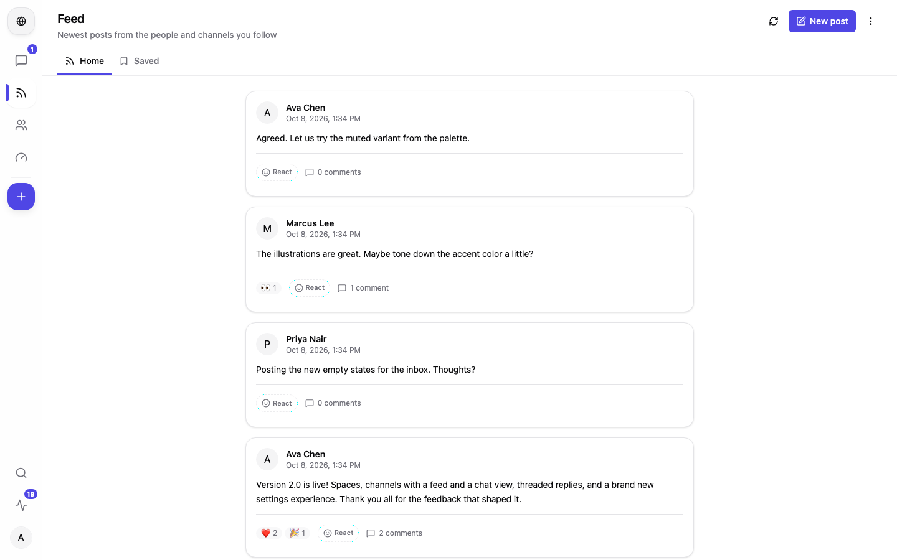 | 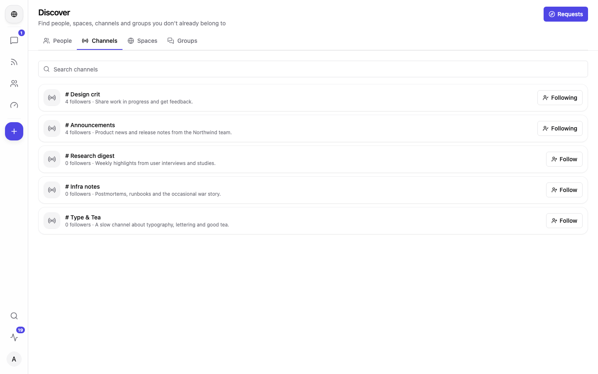 |
| Home feed | Discover |
| 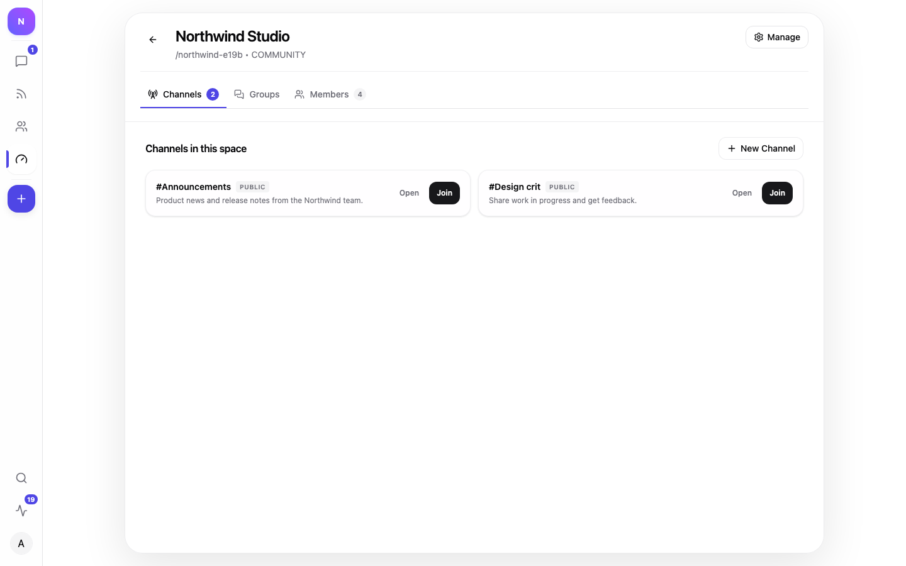 | 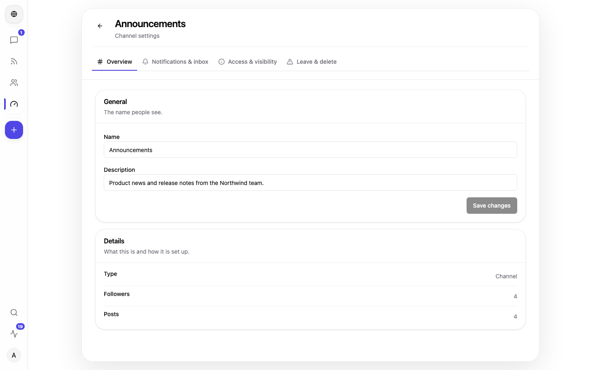 |
| Space home | Channel management |
| 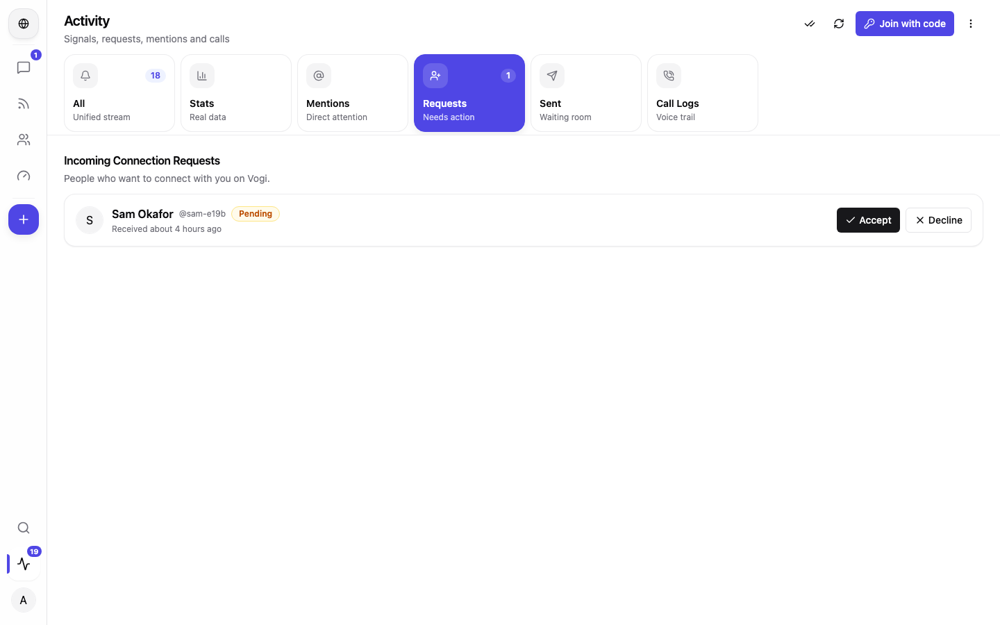 | 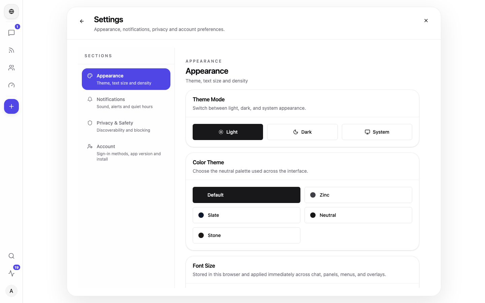 |
| Activity | Settings |
| 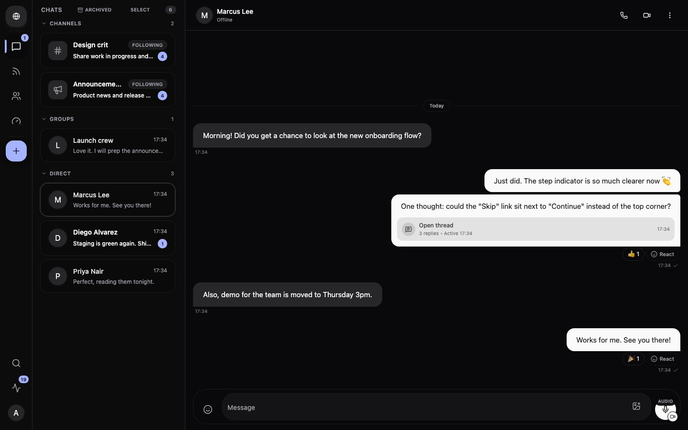 | 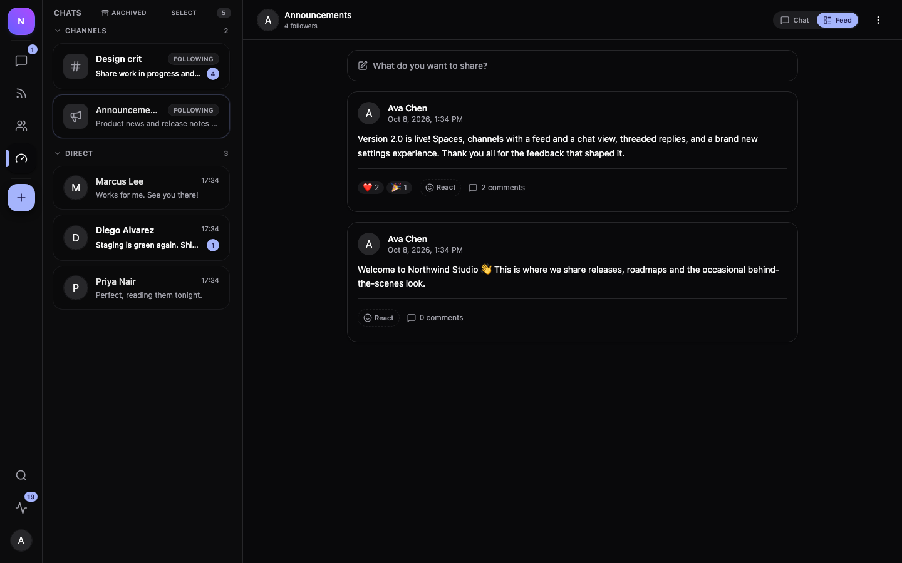 |
| Dark theme | Dark theme |

<p align="center">
  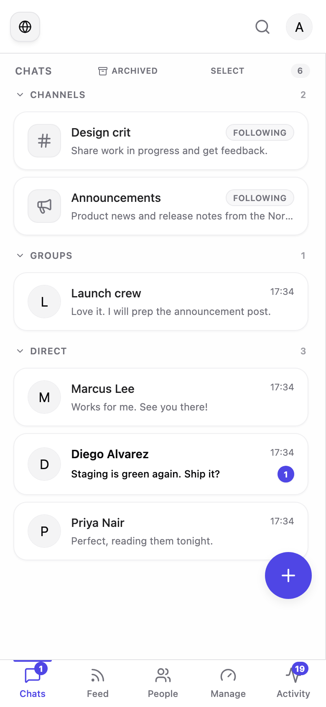
  &nbsp;
  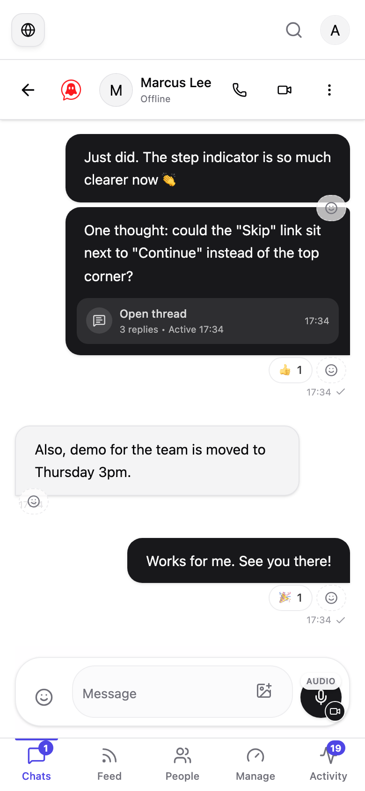
</p>

All screenshots are generated from seeded demo data by `npm run docs:screenshots`. See [docs/screenshots](./docs/screenshots/README.md).

## Quick start

1. Start the backend. In `../VoiceChat`, run `docker compose up -d` (see its [README](../VoiceChat/README.md)).
2. Install dependencies:

   ```bash
   npm install
   ```

3. Create `.env.local` with the backend URLs:

   ```bash
   VITE_API_URL=http://localhost:8000
   VITE_SOCKET_URL=http://localhost:8000
   ```

4. Start the dev server:

   ```bash
   npm run dev     # http://localhost:3000
   ```

5. Sign in with any email address. The verification code arrives in MailHog at <http://localhost:8025>.

## Scripts

| Command | What it does |
|---|---|
| `npm run dev` | Vite dev server on port 3000 |
| `npm run build` | Production build to `dist/` |
| `npm run preview` | Serve the production build |
| `npm run lint` | Type check (`tsc --noEmit`). There is no ESLint. |
| `npm run test:unit` | Vitest unit tests |
| `npm run test:e2e` | Playwright end-to-end tests (Chromium, Firefox, WebKit) |
| `npm run docs:screenshots` | Regenerate the documentation screenshots |
| `npm run sync:openapi` | Copy the backend's OpenAPI schema into `openapi/` |
| `npm run generate:api-contract` | Regenerate `src/api/openapi-contract.ts` |
| `npm run test:api-contract` | Check the client's API usage against the schema |
| `npm run build:mobile`, `npm run sync:mobile:android` | Android build and sync. See [`mobile/README.md`](./mobile/README.md). |

## Testing

```bash
npm run lint                                   # type check
npm run test:unit                              # all unit tests
npx vitest run src/path/to/file.test.ts        # one file
npm run test:e2e                               # Playwright
```

`tsconfig.json` has `strict` off, so `tsc` will not catch null dereferences. Guard optional fields by hand.

Known Playwright baseline: **9 passed / 6 failed** across three browsers. `spaces.spec.ts` asserts stale `SpaceSwitcher` labels, and `fe-domain-smoke.spec.ts` needs a running backend whose verification emails reach MailHog. Check that the failure count has not grown, rather than expecting green.

## Documentation

| | |
|---|---|
| [Architecture](./docs/architecture.md) | Source layout, the container descriptor, capabilities, settings, realtime |
| [Routes](./docs/routes.md) | Every route, its page, and legacy redirects |
| [Screenshots](./docs/screenshots/README.md) | How the screenshot pipeline works and how to rerun it |
| [`src/container/AGENTS.md`](./src/container/AGENTS.md) | Why containers are modelled as descriptors |
| [`src/features/chat/AGENTS.md`](./src/features/chat/AGENTS.md) | Chat feature design notes |
| [Mobile](./mobile/README.md) | Android companion app |
| [Backend docs](../VoiceChat/docs/index.md) | API reference and realtime events |

## Project layout

```text
src/
  App.tsx       route table
  app/          routes, app shell, legacy redirects
  api/          HTTP client, endpoints, query keys, OpenAPI contract
  container/    container descriptor, capabilities, message hooks
  features/     auth · calls · channels · chat · discovery · feed · invite · landing
                manage · notifications · profile · settings · settings-container · spaces
  socket/       Socket.IO client and channel rooms
  store/        Zustand stores
mobile/         Android companion app (Capacitor)
screenshots/    documentation screenshot pipeline
tests/          Playwright specs
docs/           this documentation
```
